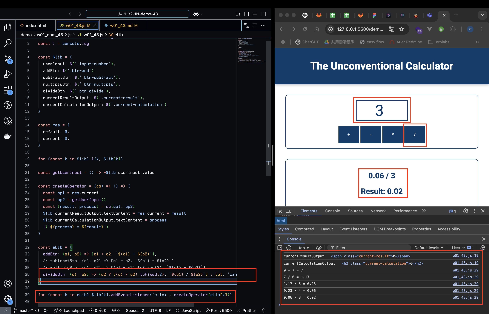
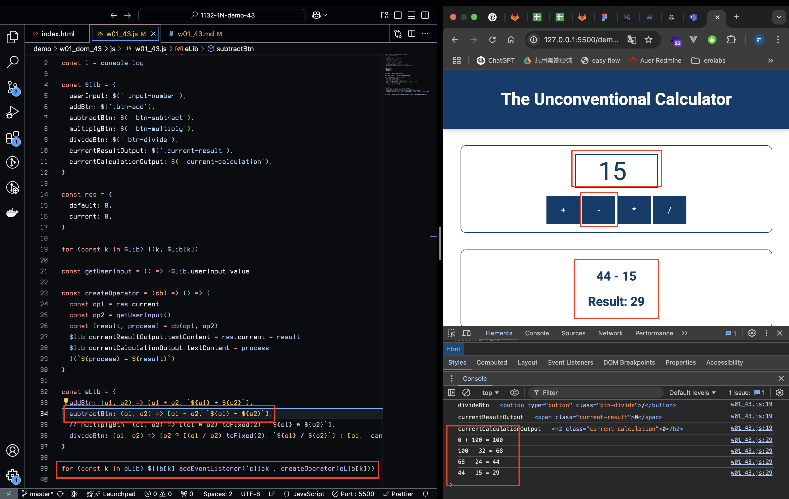
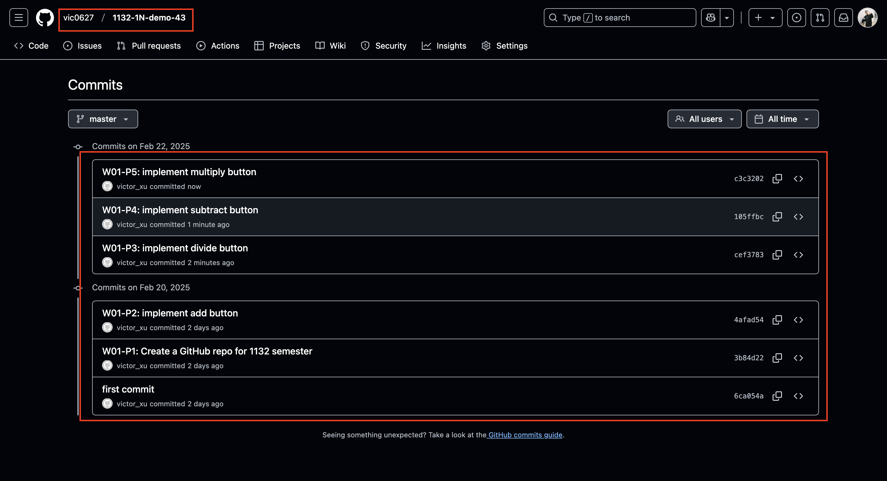

[GitHub URL](https://github.com/vic0627/1132-1N-demo-43)

### W01-P1: Create a GitHub repo for 1132 semester

#### => Github repo
 

 
#### => share to teacher and TA


 
```
3b84d22 victor_xu       Thu Feb 20 20:38:46 2025 +0800  W01-P1: Create a GitHub repo for 1132 semester
```

### W01-P2: implement add button
 

 
```
4afad54 victor_xu       Thu Feb 20 20:39:03 2025 +0800  W01-P2: implement add button
```

### W01-P3: implement divide button
 

 
```
cef3783 victor_xu       Sat Feb 22 08:31:41 2025 +0800  W01-P3: implement divide button
```
 
### W01-P4: implement subtract button
 

 
```
105ffbc victor_xu       Sat Feb 22 08:32:35 2025 +0800  W01-P4: implement subtract button
```
 
### W01-P5: implement multiply button
 

 
```
c3c3202 victor_xu       Sat Feb 22 08:33:17 2025 +0800  W01-P5: implement multiply button
```

### W01-logs: git logs of W01
 
