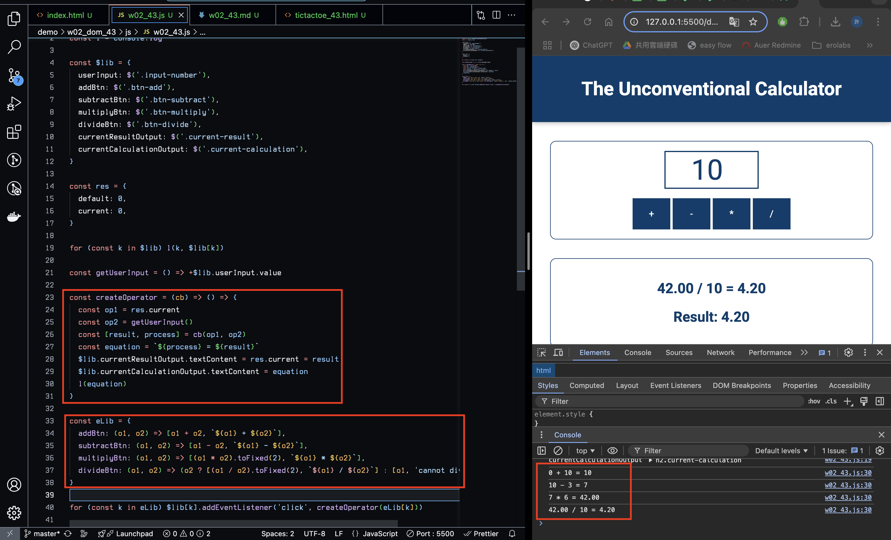
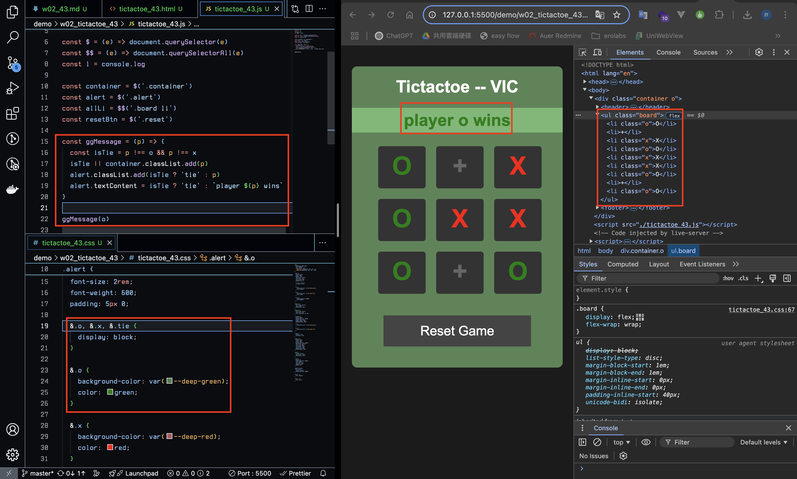
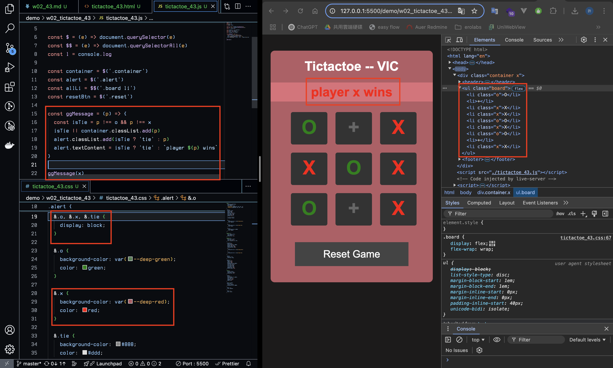
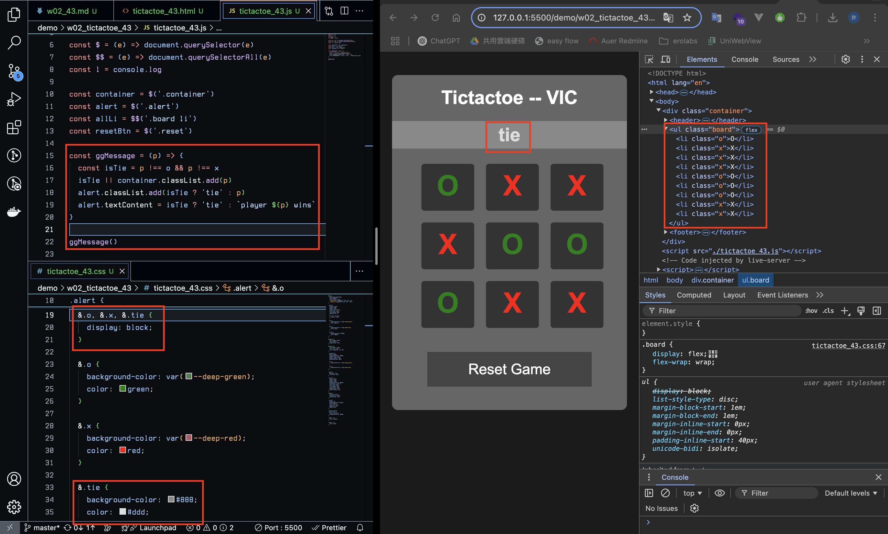
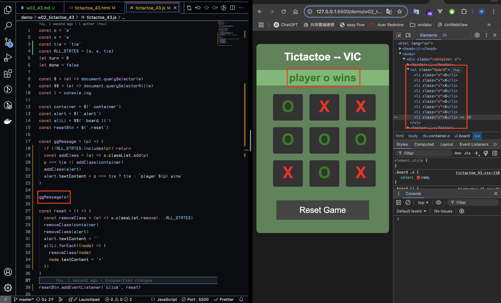
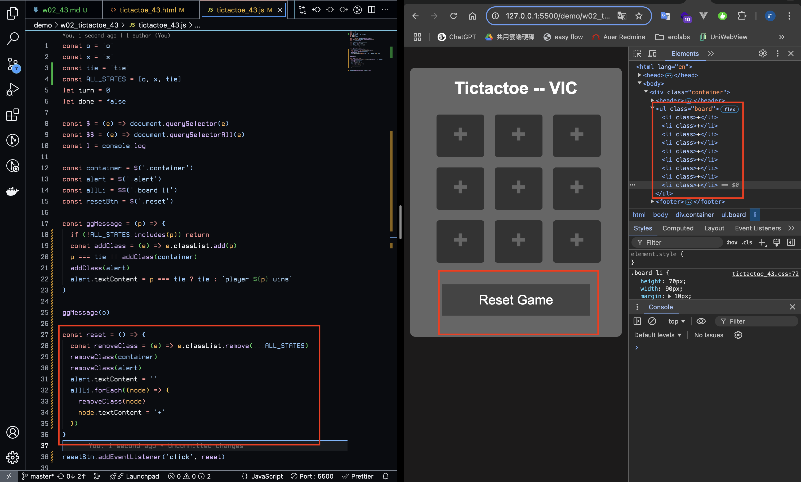
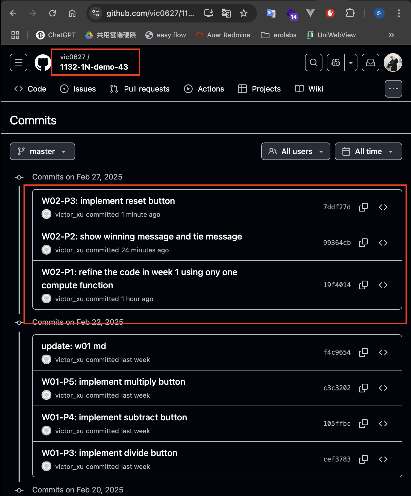

[GitHub URL](https://github.com/vic0627/1132-1N-demo-43)

### W02-P1: refine the code in week 1 using ony one compute function
 


```
19f4014 victor_xu       Thu Feb 27 19:39:41 2025 +0800  W02-P1: refine the code in week 1 using ony one compute function
```

### W02-P2: show winning message and tie message
 
#### ==> play o wins
 

 
#### ==> play x wins
 

 
#### ==> tie
 

 
```
99364cb victor_xu       Thu Feb 27 20:37:23 2025 +0800  W02-P2: show winning message and tie message
```

### W02-P3: implement reset button
 
#### ==> initially player o win
 

 
#### ==> after reset button is pressed
 

 
```
7ddf27d victor_xu       Thu Feb 27 21:00:25 2025 +0800  W02-P3: implement reset button
```

### W02-logs: git logs of W02
 
