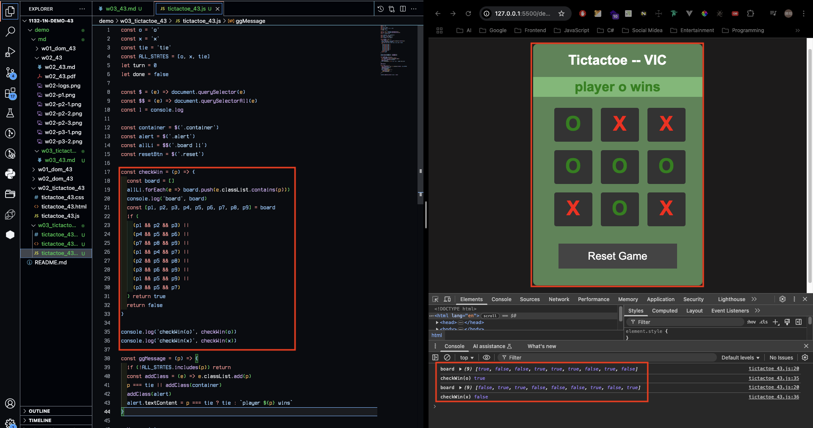
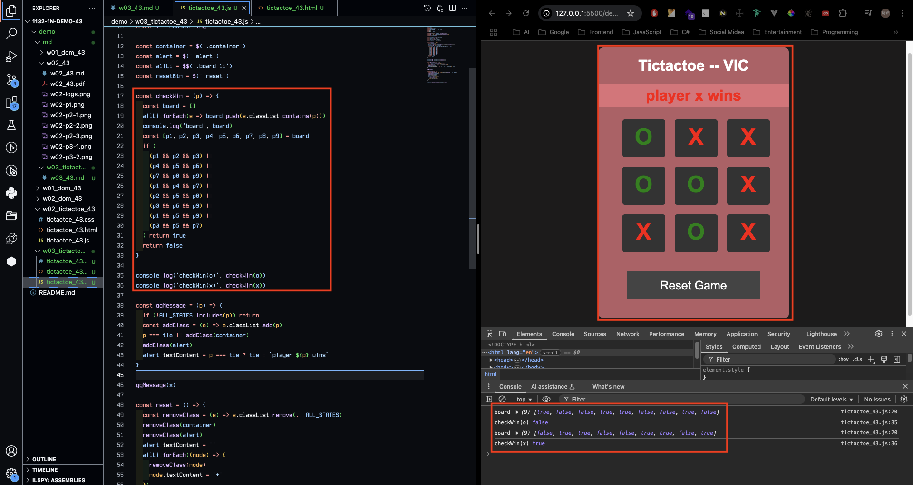
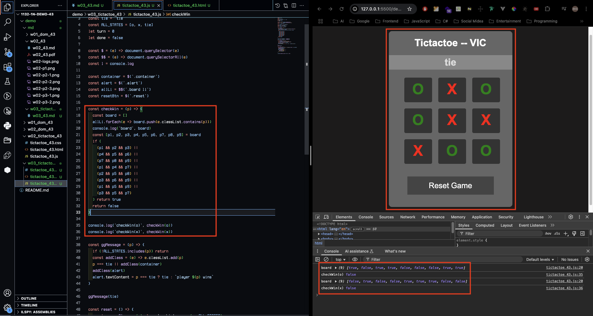
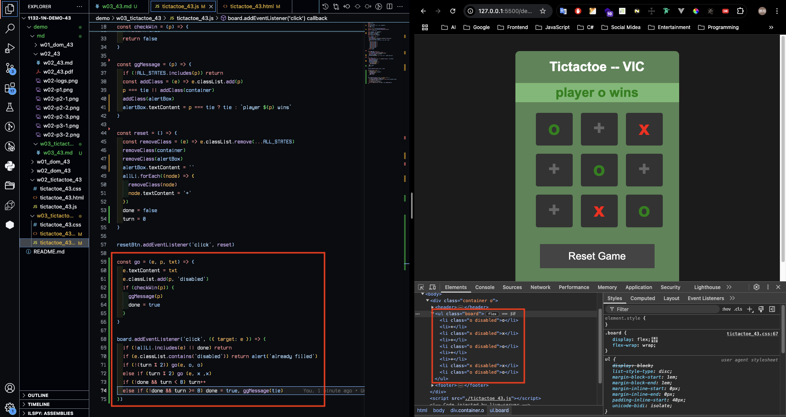
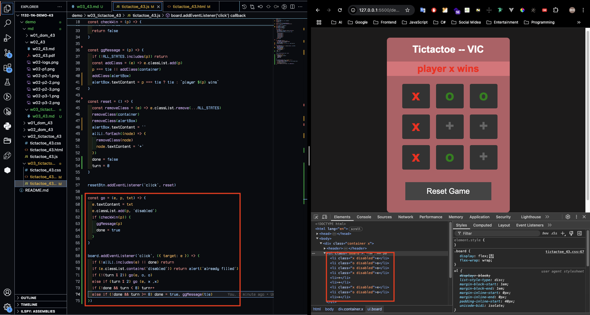
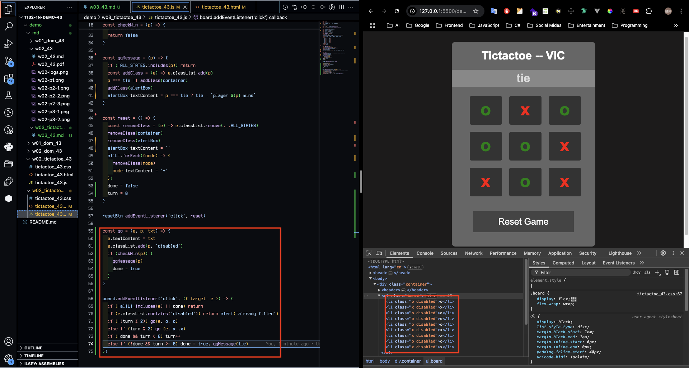
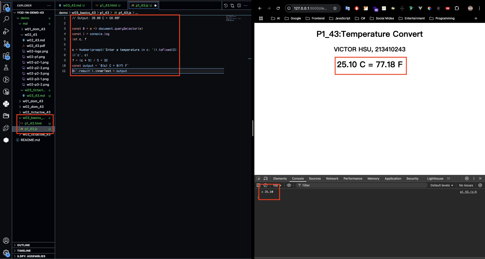
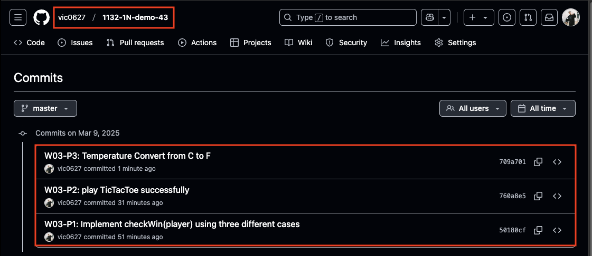

[GitHub URL](https://github.com/vic0627/1132-1N-demo-43)

### W03-P1: Implement checkWin(player) using three different cases
 
#### => player o wins
 

 
#### => player x wins
 

 
#### => no player wins
 

 
```
50180cf victor_xu       Sun Mar 9 10:20:41 2025 +0800   W03-P1: Implement checkWin(player) using three different cases
```

### W03-P2: play TicTacToe successfully
 
#### => player o wins
 

 
#### => player x wins
 

 
#### => tie
 

 
```
760a8e5 victor_xu       Sun Mar 9 10:40:45 2025 +0800   W03-P2: play TicTacToe successfully
```

### W03-P3: Temperature Convert from C to F
 

 
```
709a701 victor_xu       Sun Mar 9 11:10:21 2025 +0800   W03-P3: Temperature Convert from C to F
```

### W03-logs: git logs of W03
 
