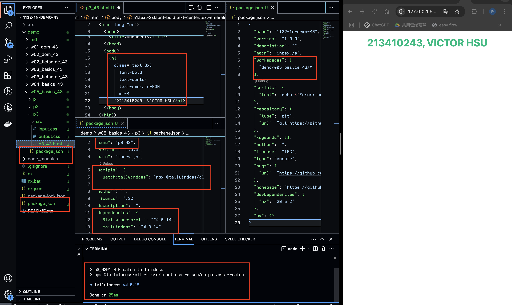
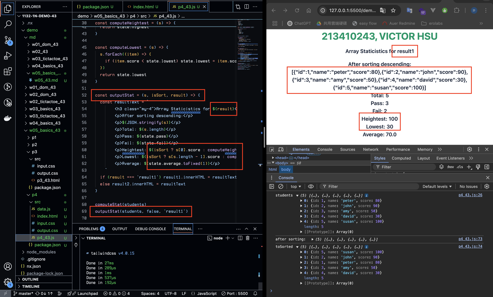
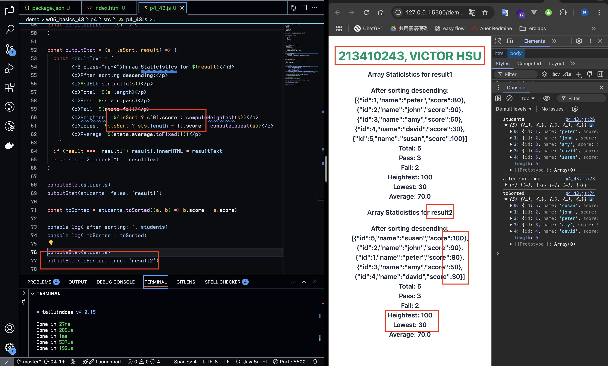
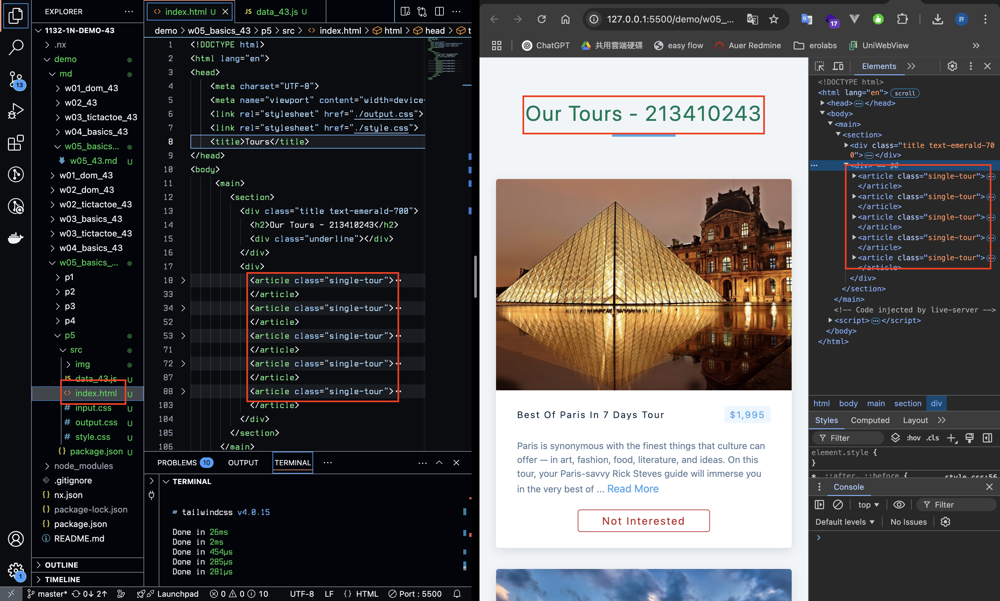
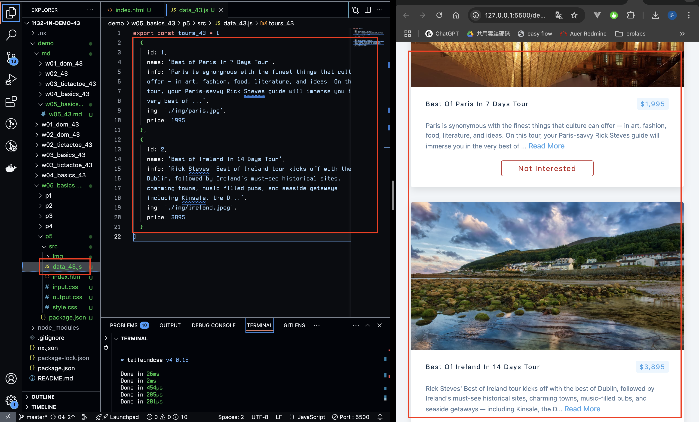
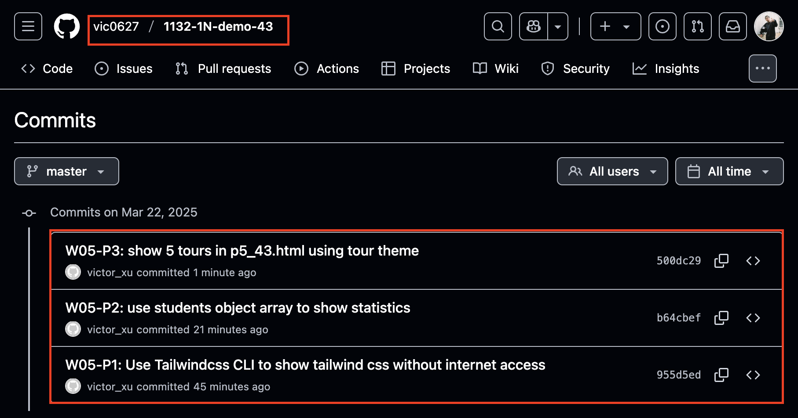

[GitHub URL](https://github.com/vic0627/1132-1N-demo-43)

### W05-P1: Use Tailwindcss CLI to show tailwind css without internet access
 

 
```
955d5ed victor_xu       Sat Mar 22 09:01:59 2025 +0800  W05-P1: Use Tailwindcss CLI to show tailwind css without internet access
```

### W05-P2: use students object array to show statistics
 
#### => no sorting, show in result1 section
 

 
#### => after sorting, show in result2 section
 

 
```
b64cbef victor_xu       Sat Mar 22 09:25:26 2025 +0800  W05-P2: use students object array to show statistics
```

### W05-P3: show 5 tours in p5_43.html using tour theme
 
#### => display 5 tours in tour theme, make tailwind css work as well
 

 
#### => use array tours_xx to store all data of 5 tours
 

 
```
500dc29 victor_xu       Sat Mar 22 09:45:57 2025 +0800  W05-P3: show 5 tours in p5_43.html using tour theme
```

### W05-logs: git logs of W05
 
