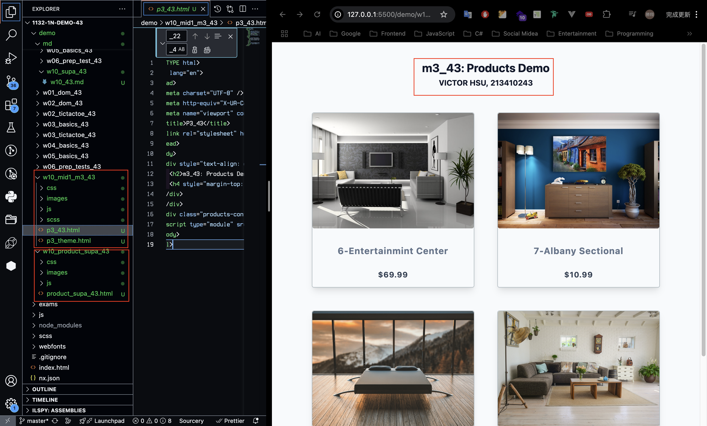
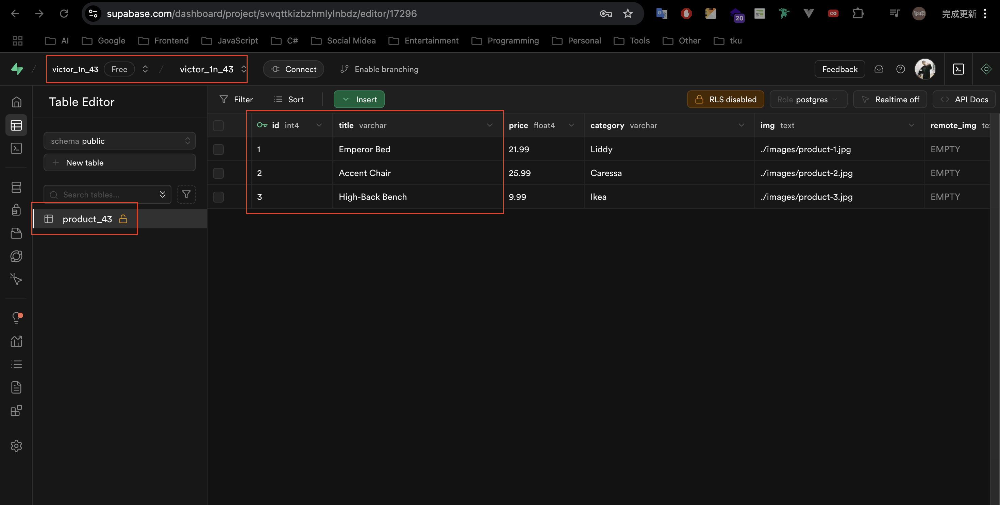
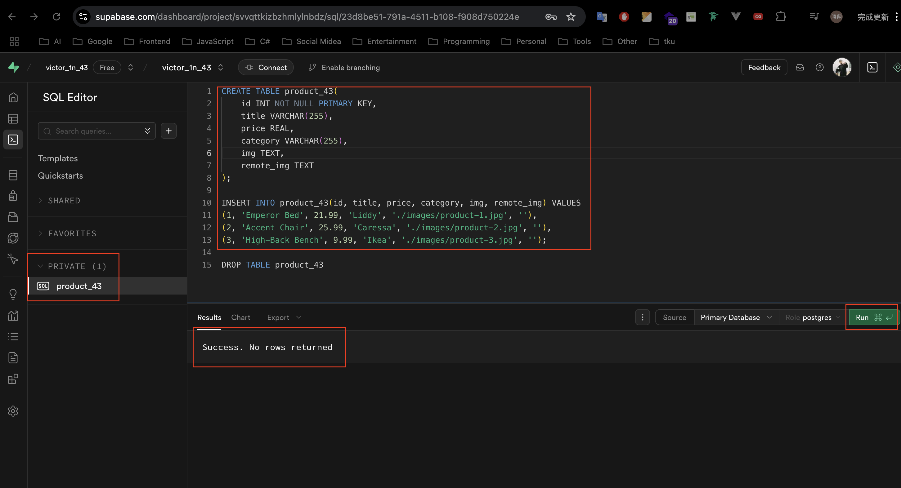
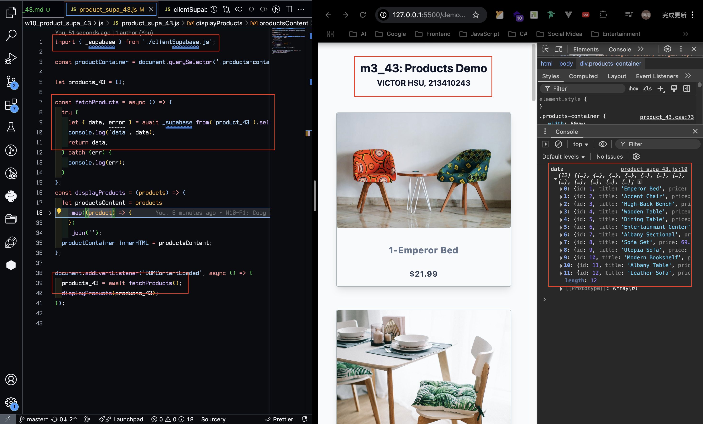
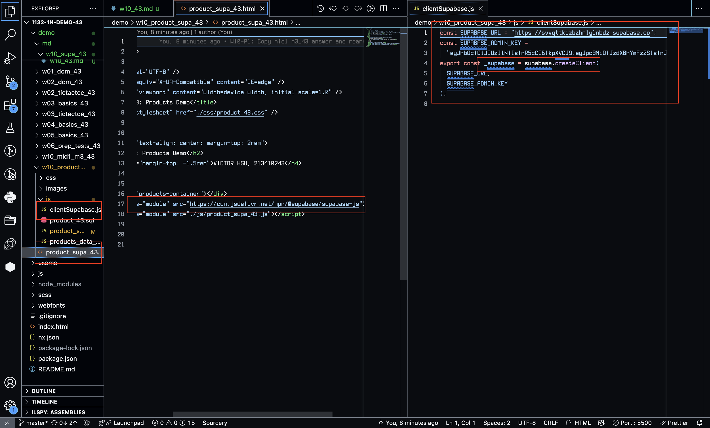
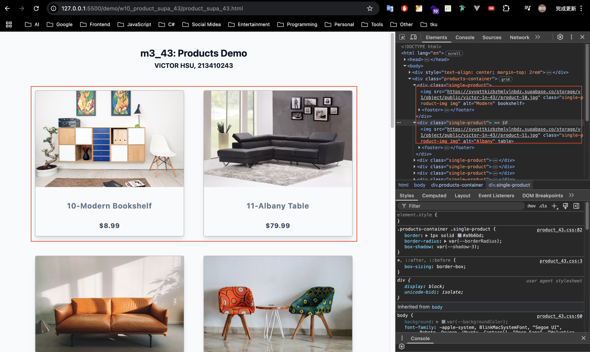
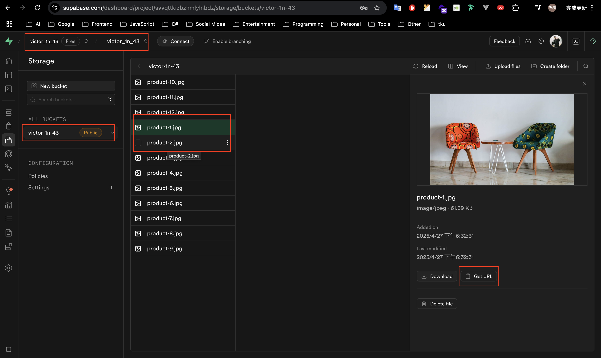
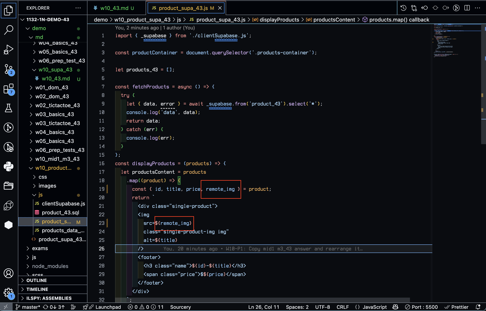
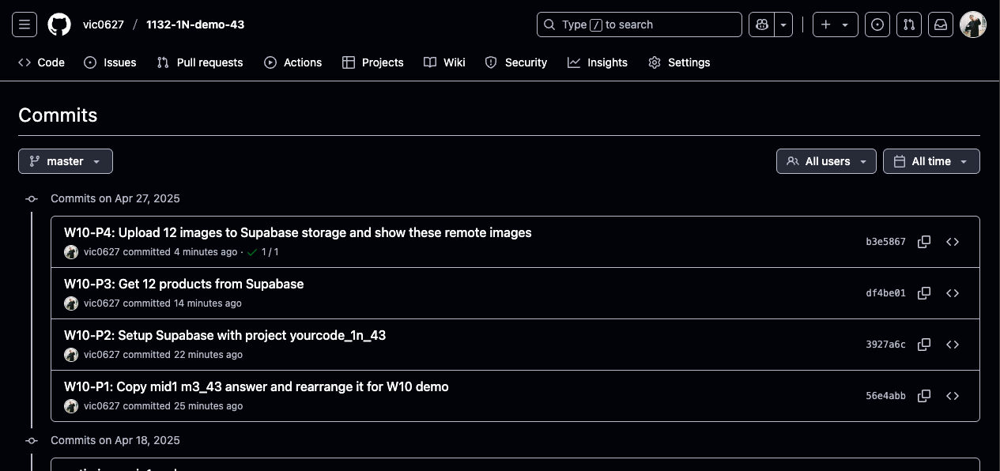

[GitHub URL](https://github.com/vic0627/1132-1N-demo-43)
[Vercel URL](https://1132-1n-demo-43.vercel.app)

### W10-P1: Copy mid1 m3_43 answer and rearrange it for W10 demo



```
56e4abb victor_xu Sun Apr 27 18:19:05 2025 +0800    W10-P1: Copy mid1 m3_43 answer and rearrange it for W10 demo
```

### W10-P2: Setup Supabase with project yourcode_1n_43

#### => show product_43 table with 3 data



#### => show SQL to create product_43 table and insert three data



#### => show Project URL and ANON KEY for this project


```
3927a6c victor_xu Sun Apr 27 18:21:28 2025 +0800    W10-P2: Setup Supabase with project yourcode_1n_43
```

### W10-P3: Get 12 products from Supabase

#### => show how to fetch products from Supabase



#### => Show how to get supabase-js to create supabase client



```
df4be01 victor_xu Sun Apr 27 18:29:46 2025 +0800    W10-P3: Get 12 products from Supabase
```

### W10-P4: Upload 12 images to Supabase storage and show these remote images

#### => show the first two images are from Supabase storage



#### => show remote_img in product_43 table



#### => show the js code to use remote_img instead of img



```
b3e5867 victor_xu Sun Apr 27 18:39:54 2025 +0800    W10-P4: Upload 12 images to Supabase storage and show these remote images
```

### W10-logs: git logs of W10


