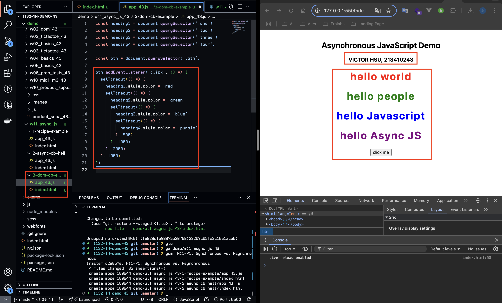
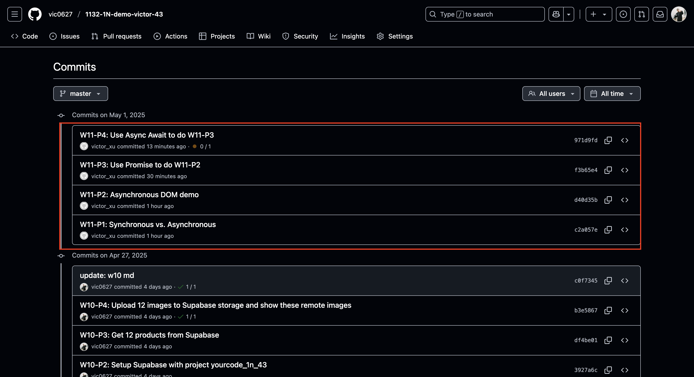

[GitHub URL](https://github.com/vic0627/1132-1N-demo-victor-43)
[Vercel URL](https://1132-1n-demo-victor-43.vercel.app)

### W11-P1: Synchronous vs. Asynchronous

#### => Synchronous demo


#### => Asynchronous demo


```
c2a057e victor_xu       Thu May 1 19:28:01 2025 +0800   W11-P1: Synchronous vs. Asynchronous
```

### W11-P2: Asynchronous DOM demo



```
d40d35b victor_xu       Thu May 1 19:54:24 2025 +0800   W11-P2: Asynchronous DOM demo
```

### W11-P3: Use Promise to do W11-P2


```
f3b65e4 victor_xu       Thu May 1 20:22:38 2025 +0800   W11-P3: Use Promise to do W11-P2
```

### W11-P4: Use Async Await to do W11-P3


```
971d9fd victor_xu       Thu May 1 20:39:18 2025 +0800   W11-P4: Use Async Await to do W11-P3
```

### W11-P5: Change GitHub repo name, and Vercel URL

#### => GitHub


#### => Vercel


### W11-logs: git logs of W11

