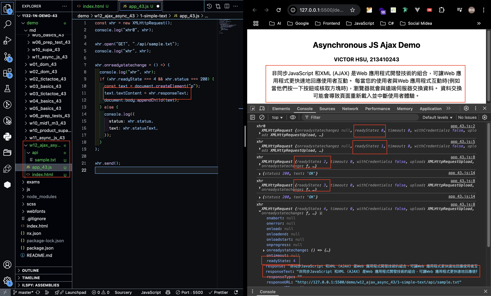
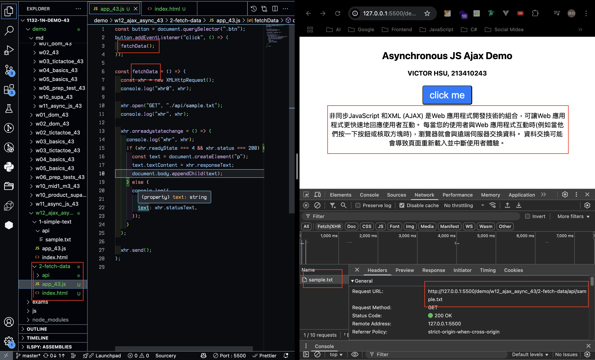
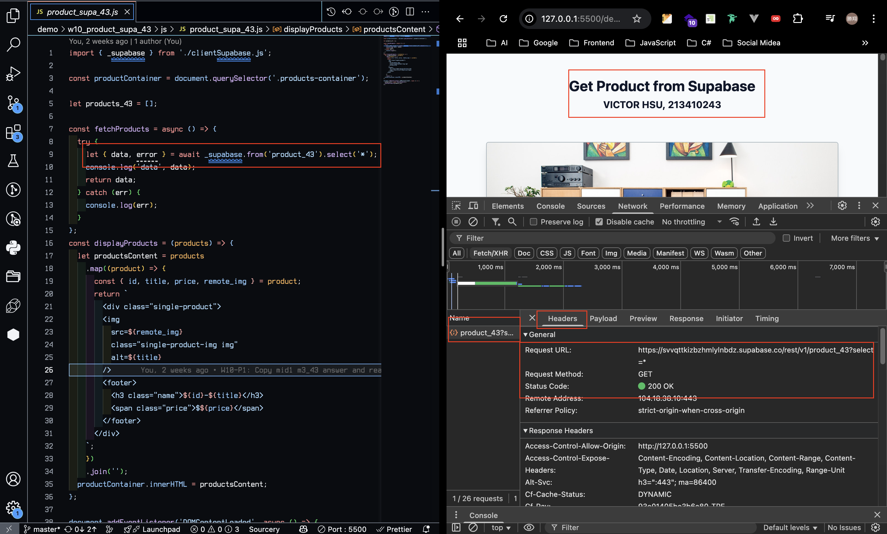
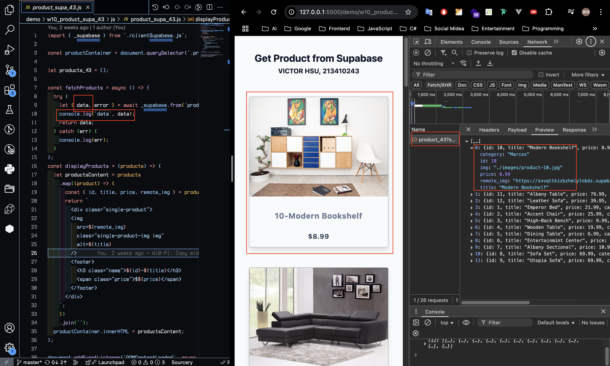
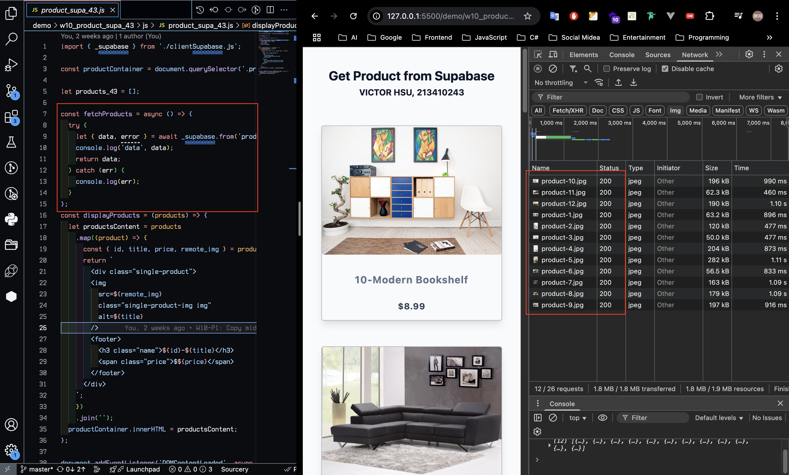
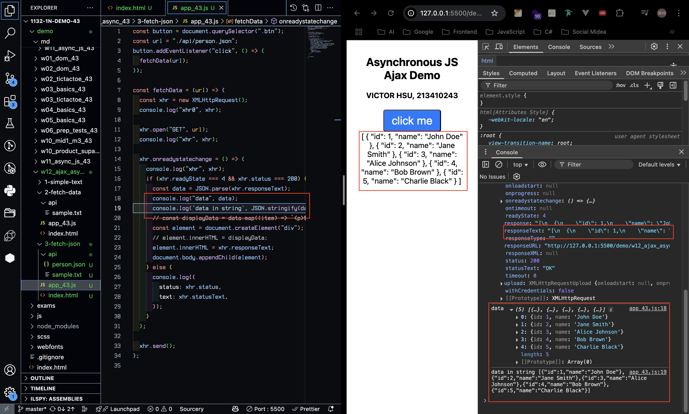
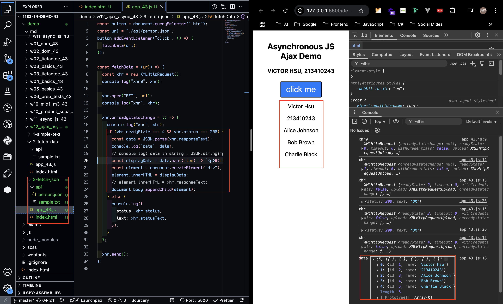
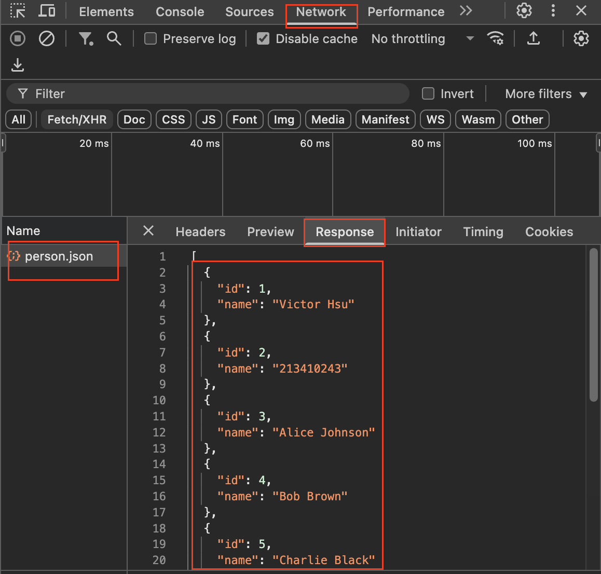
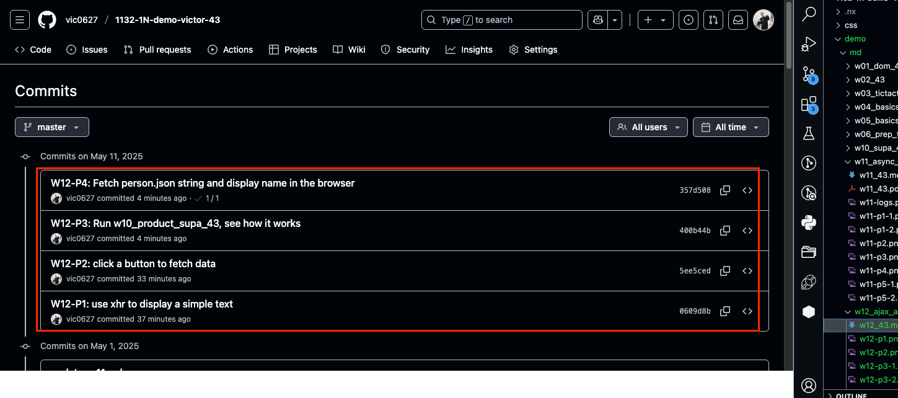

[GitHub URL](https://github.com/vic0627/1132-1N-demo-victor-43)
[Vercel URL](https://1132-1n-demo-victor-43.vercel.app)

### W12-P1: use xhr to display a simple text



```
0609d8b victor_xu       Sun May 11 15:32:43 2025 +0800  W12-P1: use xhr to display a simple text
```

### W12-P2: click a button to fetch data



```
5ee5ced victor_xu       Sun May 11 15:36:45 2025 +0800  W12-P2: click a button to fetch data
```

### W12-P3: Run w10_product_supa_43, see how it works

#### => \_supabase.from('product_43').select('\*');



#### => check response



#### => check how many http requests being done in fetchProducts



```
400b44b victor_xu       Sun May 11 16:04:37 2025 +0800  W12-P3: Run w10_product_supa_43, see how it works
```

### W12-P4: Fetch person.json string and display name in the browser

#### => use JSON.parse() to convert responseText to JSON array



#### => extract name from data and show it in the browser



#### => check the Network, http response



```
357d508 victor_xu       Sun May 11 16:03:18 2025 +0800  W12-P4: Fetch person.json string and display name in the browser
```

### W12-logs: git logs of W12

