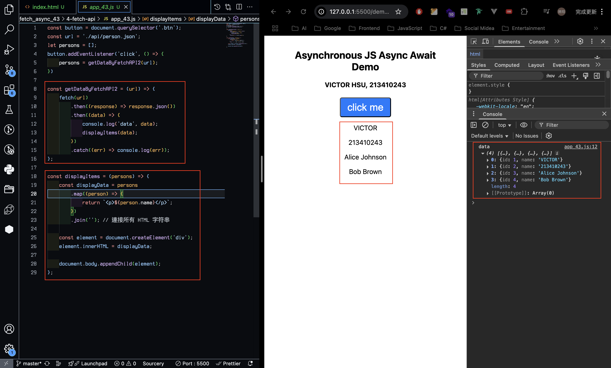
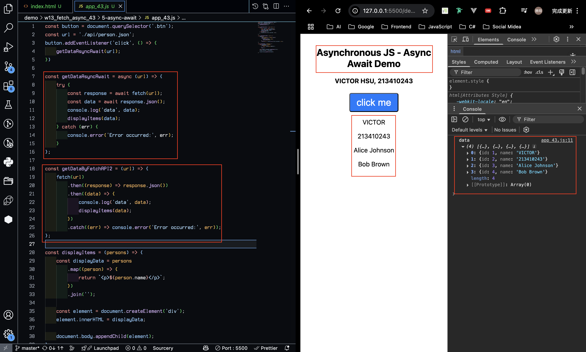
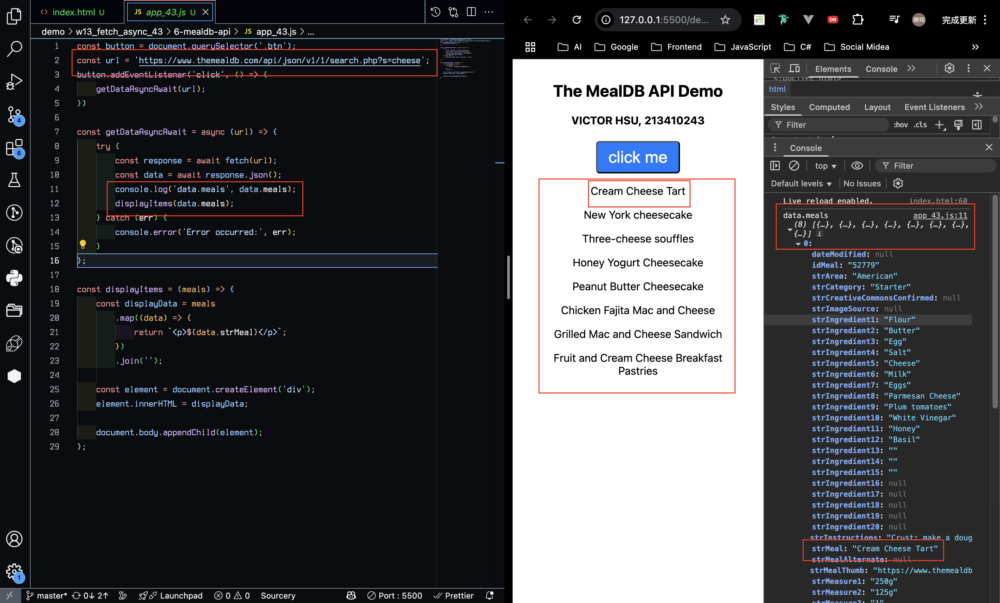
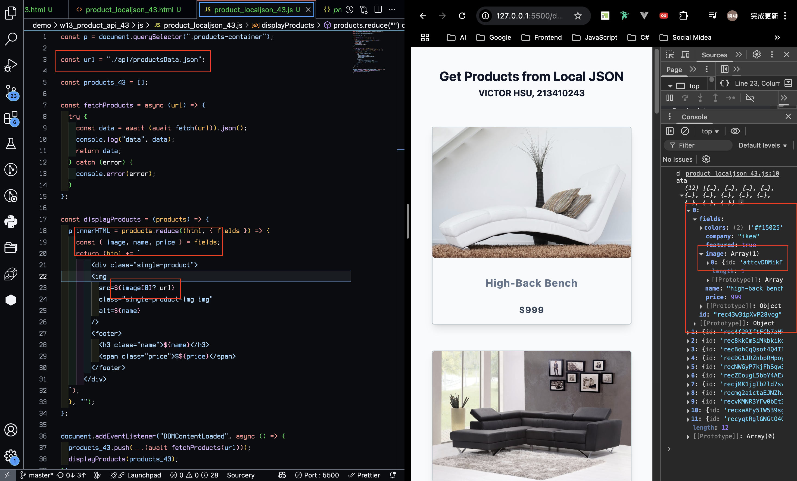
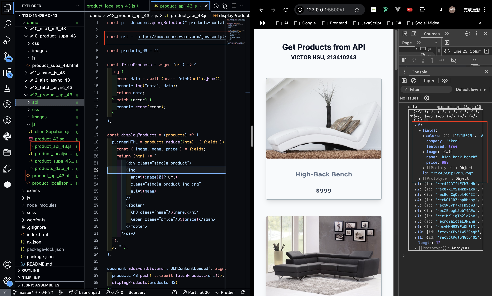
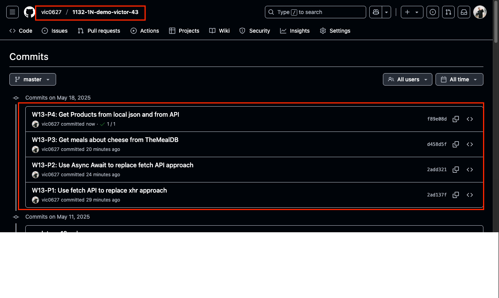

[GitHub URL](https://github.com/vic0627/1132-1N-demo-victor-43)
[Vercel URL](https://1132-1n-demo-victor-43.vercel.app)

### W13-P1: Use fetch API to replace xhr approach



```
2ad137f victor_xu       Sun May 18 21:00:16 2025 +0800  W13-P1: Use fetch API to replace xhr approach
```

### W13-P2: Use Async Await to replace fetch API approach



```
2add321 victor_xu       Sun May 18 21:05:10 2025 +0800  W13-P2: Use Async Await to replace fetch API approach
```

### W13-P3: Get meals about cheese from TheMealDB



```
d458d5f victor_xu       Sun May 18 21:08:48 2025 +0800  W13-P3: Get meals about cheese from TheMealDB
```

### W13-P4: Get Products from local json and from API

#### => Get products from local json



#### => Get products from API



```
f89e08d victor_xu       Sun May 18 21:28:49 2025 +0800  W13-P4: Get Products from local json and from API
```

### W13-logs: git logs of W13


